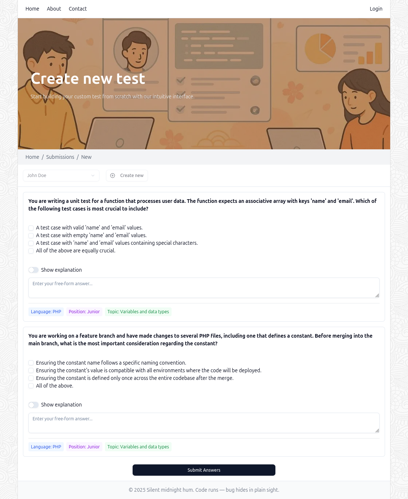

# HireBot AI App Lite

HireBot AI App Lite is a streamlined technical assessment platform for evaluating candidates' programming skills. This application allows recruiters and hiring managers to create customized assessments, manage candidates, and evaluate their technical knowledge efficiently.

## Features

- **Candidate Management**: Add and track candidates through the hiring process
- **Customizable Assessments**: Create assessments with questions filtered by programming language, topic, and position
- **Interactive Question Interface**: Multiple-choice questions with explanations and free-form text answers
- **Code Snippets Support**: Questions can include formatted code snippets for technical evaluations
- **Submission Scoring**: Automatic scoring of candidate submissions
- **Detailed Results View**: Comprehensive submission analysis with statistics and answer breakdowns
- **Essay Questions**: Support for free-form essay questions in addition to multiple-choice
- **Candidate Profiles**: Detailed candidate information including skills and experience level

## Tech Stack

- **Frontend**: Next.js 15.3, React 19, TypeScript 5.8, Tailwind CSS 4.1
- **UI Components**: Shadcn UI with Radix UI primitives
- **State Management**: React Context API and React Query
- **API Integration**: Axios for custom API services
- **Markdown Support**: React Markdown with syntax highlighting
- **Testing**: Jest 29, React Testing Library
- **Development**: Turbopack for faster development experience

## Screenshots



## Getting Started

### Prerequisites

- Node.js 20.x or higher
- [Bun](https://bun.sh/) runtime

### Installation

1. Clone the repository:

   ```bash
   git clone https://github.com/yourusername/hirebot-ai-app-lite.git
   cd hirebot-ai-app-lite
   ```

2. Install dependencies:

   ```bash
   bun install
   ```

3. Run the development server:

   ```bash
   bun dev
   ```

4. Open [http://localhost:3000](http://localhost:3000) with your browser to see the application.

## Project Structure

- `/src/app`: Next.js app router pages and layouts
- `/src/components`: Reusable UI components
  - `/src/components/ui`: Shadcn UI components
  - `/src/components/layout`: Layout components
  - `/src/components/common/__tests__`: Component tests
- `/src/contexts`: React context providers
- `/src/services`: API service functions
- `/src/hooks`: Custom React hooks
- `/src/types`: TypeScript type definitions
- `/src/lib`: Utility functions

## Testing

The project uses Jest and React Testing Library for testing components and functionality.

### Running Tests

```bash
# Run all tests
bun test

# Run tests in watch mode
bun test:watch

# Run tests for a specific component
bun test -- LoadingComponent
```

For more information about the testing approach, see the [testing documentation](./src/components/common/__tests__/README.md).

## Contributing

Contributions are welcome! Please feel free to submit a Pull Request.

1. Fork the repository
2. Create your feature branch (`git checkout -b feature/amazing-feature`)
3. Commit your changes (`git commit -m 'Add some amazing feature'`)
4. Push to the branch (`git push origin feature/amazing-feature`)
5. Open a Pull Request

## License

This project is licensed under the MIT License - see the LICENSE file for details.

## Acknowledgments

- Built with [Next.js](https://nextjs.org)
- UI components from [Shadcn UI](https://ui.shadcn.com)
- Icons from [Lucide](https://lucide.dev)
- Query management with [TanStack Query](https://tanstack.com/query)
