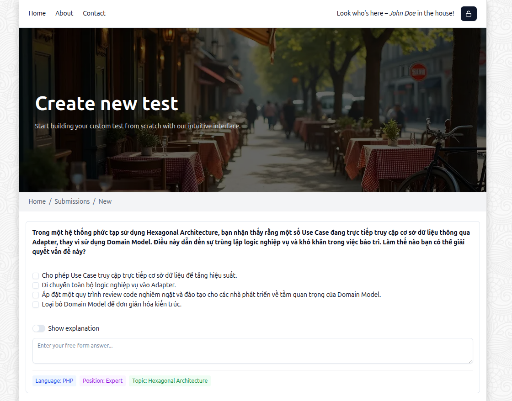

<div align="center">
  
</div>

# HireBot AI App Lite

HireBot AI App Lite is a streamlined technical assessment platform for evaluating candidates' programming skills. This application allows recruiters and hiring managers to create customized assessments, manage candidates, and evaluate their technical knowledge efficiently.

<div align="center">
  
</div>

## 📋 Table of Contents

- [Features](./docs/features.md)
- [Architecture & Design](./docs/architecture.md)
- [Tech Stack](./docs/tech-stack.md)
- [Getting Started](./docs/getting-started.md)
- [Project Structure](./docs/project-structure.md)
- [Testing](./docs/testing.md)
- [Contributing](./docs/contributing.md)
- [License](./docs/license.md)
- [Acknowledgments](./docs/acknowledgments.md)

## ✨ Overview

HireBot AI App Lite is designed to streamline the technical assessment process for hiring teams. With a focus on user experience and efficiency, the platform offers:

- Comprehensive candidate management
- Customizable technical assessments
- Multiple question types including code evaluation
- Automated scoring and detailed analysis
- Responsive and accessible interface

For detailed information about features, architecture, and how to get started, please refer to the documentation in the [docs](./docs) folder.

## 🚀 Quick Start

```bash
# Clone the repository
git clone https://github.com/yourusername/hirebot-ai-app-lite.git
cd hirebot-ai-app-lite

# Install dependencies
bun install

# Start the development server
bun dev
```

Visit [http://localhost:3000](http://localhost:3000) to see the application running.

## 📄 License

This project is licensed under the GNU General Public License v3.0 (GPL-3.0) - see the [LICENSE](LICENSE) file for details.